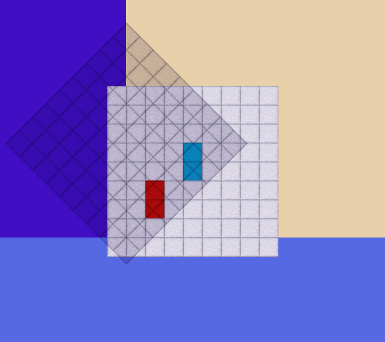

#### Str8
This one iz easy becoz it's wery zimilar to the first part of the previous problem. 
Here there are some squares called *segments* and ve have to find a straight line
crossing maximum possible number of them » 
[clck](https://ioinformatics.org/files/ioi1990round2.pdf).
```json
y|       h---------g      If we consider this case, than 
 |       |         |      all vertial lines from
 |       e---------f      B to C are solutions.
 |       '         '
 |  d----'--c      '
 |  |    '  |      '
 |  a----'--b      '      #0) <- smiling cyclops with funny haircut
 |  '    '  '      '
 o--'----'--'------'---x
    A    B  C      D
```
..
```C#
                                       y| 
                        y`              |                                   
                        .               |            .h-------g             
 Here segment            `.             |          .` |      .`        _____________
 projections over x and y  `.           |        .`   e--- .`-f        _____________
 are not intersecting, so we `.         |      .`        .`            __Boom!______
 rotate ze coor-system and ck  `.       |  d-.`----c   .`              _____________
 the corresponding segment       `.     |  .`      | .`                _____________
 projections. In this case all     `.   |.`a-------b`                  _____________
 lines perpendicular to y` in the    `..`        .`                    _____________
 interval [H, B], vich is the         H`o------.`---------------x           
 intersection of ze sement projections   `.  .`                             
 over y`, will cross both segments.        ``                               
                                           B `.                             
                                               `.                           
                                                 `.
```
#### Hue CMe Ko74ècTtp!!
If a system is rotated  counter-clock-wise by angle **ਉ** zen ze coorz are 
transformed as follows:
```Python
┏  ┓ ┏            ┓┏ ┓  6aG rAHbo
┃x'┃=┃ cosβ  sinβ ┃┃x┃  MuHucTĕp                                    
┃y'┃ ┃-sinβ  cosβ ┃┃y┃  npeFegaTe7                                     
┗  ┛ ┗            ┛┗ ┛                                      
``` 
Zo we can use this formula to find segment scope projections over a given coor.
The resultig list will be similar to the ***Guard Shedule*** in *prob1*.

#### University of Sussex sucks! *
Before ve stated 2 methods for counting intersections, there is a third:
```bash
  let's have couple of; intervalz:
              <                       >
              `                       `           [   ]
      (       `   )                   `           _   _
      '     { `   '       }           `           _   _
      '     - `   '       -           `           _   _
  . . ' . . - ` . ' . . . - . . . . . ` . . . . . _ . _ . . . .
  |         '         |         '         |         '         |
  0         5         10        15        20        25        30
  zen we'll have the following intasections:
  ( 2,  5) - 1  We sort endpoints in a list zen ve count how many times
  ( 5,  6) - 2  each endpoint interval is a subset of ze above intervals.
  ( 6,  8) - 3  
  ( 8, 12) - 2  (*) - TBa 6eEe noc7egHaTa pen7uKa npegu ga HactckaT Hsko7ko
  (12, 18) - 1        aHr7uGcKu 6y7gora npoTuB MeH oT geKaHaTa, goKaTo ce
  (24, 26) - 1        npe6epa go 7oHgoH Mu ce pa3Ka3a urpaTa.
```
Zo the plan is very simple:) for all angles in the range *[0, 90)* ve count ze
intasections for both *x* and *y* projections and scan for ze maximum one, thatz.



Here we have *2* segments *(1,1,2,3)* and *(3,3,4,5)* and ze oufut iz:
```json
In [1]: system("./str8.py")
angle    : 45
coor     : y
endpoints: [(-0.7071, 1.4142)]
Out[1]: 0
```
That is rotate *y* axis to *45* degrees, and take all perpendicular lines 
from *-0.7071* to *1.4142*.

https://youtu.be/qijZwhmhNvo